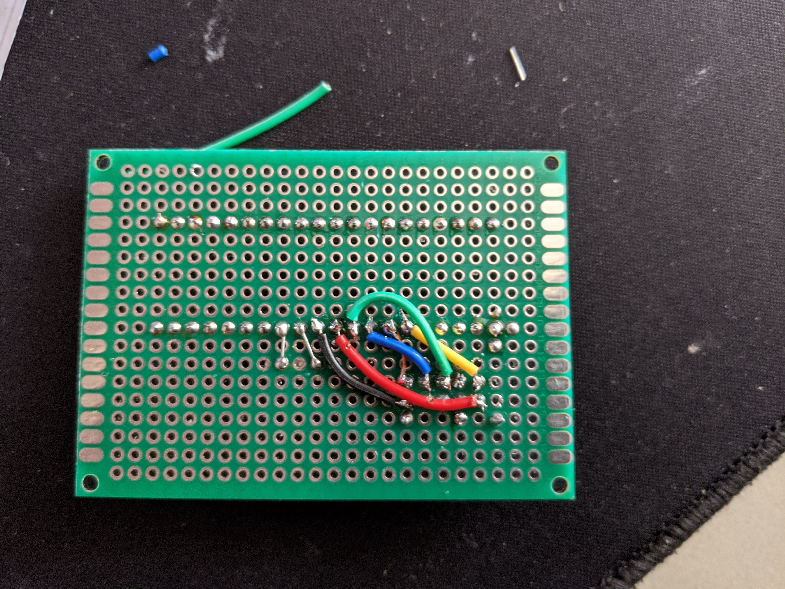

# Bootloader

## Software

Custom bootloader is available here: [https://github.com/SolanaFish/USBaspLoader](https://github.com/SolanaFish/USBaspLoader)

usbAsp drivers: [https://www.fischl.de/usbasp/](https://www.fischl.de/usbasp/)

Driver installer [https://zadig.akeo.ie/](https://zadig.akeo.ie/)

Life saving stackexchange answer: [https://electronics.stackexchange.com/questions/416714/avrdude-does-not-recognize-usbasp-device/417509#417509](https://electronics.stackexchange.com/questions/416714/avrdude-does-not-recognize-usbasp-device/417509#417509)

## Hardware

Programming is done with usbasp.
You need custom board for programming the controller. Desing and usage: 




## Building

  - Follow the directions in the readme for directions on setting up the build environment for your operating system as well as flash instructions.
  - Connect the usbadb to programming board and PC.
  - ```make flash``` (flashes makefile)
  
  -	```make fuse``` (sets fuses for microcontroller)

## Enter bootloader mode

1. Press and hold ```BOOT``` switch
2. Tap ```RESET``` switch
3. Release ```BOOT``` switch

Alternatively, you can hold ```BOOT``` switch while inserting the USB cable.

If you have successfully entered bootloader mode you should see USBaspLoader in device manager or as a connected device in QMK Toolbox.